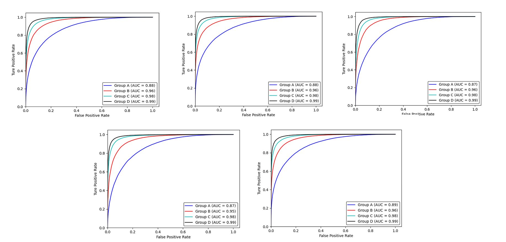

# PEVI

####  Prokaryotic and Eukaryotic virus identification in virome data based on deep learning

#### 1.Installation

#### Dependencies

PEVI requires:

```python
Python        =3.6.12 
biopython     =1.78
pandarallel   =1.5.1
pandas        =1.1.5
sgt           =2.0.3
Tensorflow-gpu=2.3.1
scikit-learn  =0.24.1
matplotlib    =3.3.3
numpy         =1.19.2
```

You can use (please create new environment to avoid unnecessary trouble bu using `conda create -n env_name python=3.6;         source activate my_env_name;   python3 -m venv /path/to/new/virtual/environment`): 

```python
pip install -r requirements.txt
```

#### 2.Usage

We provide very user-friendly usage. you just download codes  add your file, then enjoy it.


```
1.Put *fasta or *fa file into current file path

2.python run.py 'your file'

3.enjoy it !
```


#### 3.Permance

The ROC curves and AUC scores of PEVI performances in each set of five-fold crossvalidation




Figure1:The ROC curves and AUC scores of PEVI performances in each set of five-fold crossvalidation. (Group A refers to 100-400bp length, Group B refers to 400-800bp length, Group C refers to 800-1200bp length, Group D refers to 1200-1800bp length)


**Accuracy** :AUC of PEVI can arrive to 0.99 on 5-fold crossvalidation when length of sequence is between 1200-1800..


**Run time** : Owing to use Google tensorflow [TFRecord](https://www.tensorflow.org/tutorials/load_data/tfrecord) file format, PEVI only spend ~40 seconds to calcuate 10,000 sequences on 32GB Nvidia graphics card GPU, 20 CPUs is a single GPU .


#### 4.Contact

If you have any questions, please don't hesitate to ask me: yinhengchuang@pku.edu.cn