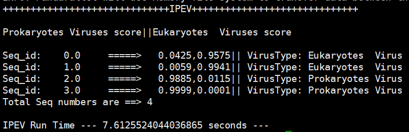

    

## IPEV: Identification of Prokaryotic and Eukaryotic Virus in virome data using deep learning

  

## Contents

- [Introduction](#Introduction)

- [Installation](#Installation)

- [Quickstart](#Quickstart)

- [Citation](#Citation)

- [Contact](#Contact)

- [License](#License)

## Introduction

IPEV applied CNN to distinguish prokaryotic and eukaryotic Virus from virome data. It is built on **Python3.8.6** , **Tensorflow  2.3.1**. IPEV calculates a set of scores that reflect the probability that the input sequence fragments are prokaryotic and eukaryotic viral sequences. By using parallelism and algorithmic optimization, IPEV gets the results of the calculations very quickly.

## Installation

File tree:

```
.
├── core/
│   ├── 1.hdf5
│   ├── 2.hdf5
│   ├── 3.hdf5
│   └── 4.hdf5
├── run.py             #main program
└── example.fasta      #example virus sequences
```

1. Download the program `git clone https://github.com/basehc/IPEV.git`
2. You can use (please create new environment to avoid unnecessary trouble by using `conda create -n env_name python=3.8.6; source activate my_env_name;  python3 -m venv /path/to/new/virtual/environment; source /path/to/new/virtual/environment//bin/activate `).
3. Configure the operating environment `python -m pip install -r requirements.txt`                         

## Quickstart

```
1.cd ./IPEV

2.python run.py example.fasta
```

## 

## Output

| Header | Prokaryotic_Virus_score | Eukaryotic_virus_score | Virus_taxon |
| ------ | ----------------------- | ---------------------- | ----------- |
| Line   | value1                  | value2                 | value3      |

## Screen output



- We recommend that users put all sequences into one ‘fasta’ file as it will greatly reduce the running time.
- The output of the screen is stored in a log.csv of temporary filefolder, meanwhile the program gives a histogram of the frequency of the scoring distribution of the sequences in the given fasta file.

## Citation

#######

## Contact

If you have any questions, please don't hesitate to ask me: yinhengchuang@pku.edu.cn or hqzhu@pku.edu.cn

## License

The source code of IPEV is distributed as open source under the [GNU GPL v3](https://www.gnu.org/licenses/gpl-3.0.en.html) , the IPEV program and all datasets  also can be freely available at  [zhulab homepage](https://cqb.pku.edu.cn/zhulab/info/1006/1156.htm)
